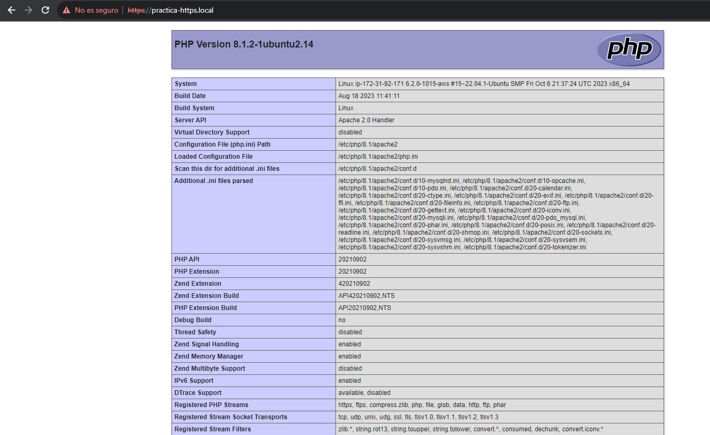

# Práctica_4 Sitio web con certificado autofirmado.
### Despliegue de una aplicación web LAMP en Ubuntu server.
### Pero,¿De que consta una pila LAMP?
Muy simple, con esto describimos un sistema de infraestructura de internet, lo que estamos buscando es desplegar una serie de aplicaciones en la web, desde un unico sistema operativo, esto quiere decir que, buscamos desplegar aplicaciones en la web de forma cómoda y rápida ejecutando un único script, el cual hay que configurar previamente.

### 1. Que representa cada letra de la palabra --> LAMP.

#### L --> Linux (Sistema operativo).
#### A --> Apache (Servidor web).
#### M --> MySQL/MariaDB (Sistema gestor de base de datos).
#### P --> PHP (Lenguaje de programación).

### Con esto, buscamos hacer un despligue de aplicaciones.

# Muestra todos los comandos que se han ejeutado.

set -x

# Actualización de repositorios
 sudo apt update

# Actualización de paquetes
# sudo apt upgrade  

# Instalamos el servidor Web apache
```
apt install apache2 -y
```
### Con esto instalamos el servidor web apache2.

### Estructura de directorios del servicio apache2.

```
 1. Directorios
  1.1 conf-available --> donde se aplican los hosts virtuales.
  1.2 conf-enabled --> donde se encuentran enlaces simbolicos a los archivos de configuracion           
  de conf-available.
  1.3 mods-available --> para añadir funcionalidades al servidor.
  1.4 mods-enabled --> enlaces simbolicos a esas funcionalidades.
  1.5 sites-available --> archivos de configuración de hosts virtuales.
  1.6 sites-enabled --> enlaces simbolicos a sites-available.
 2. Ficheros
  2.1 apache2.conf --> Archivo de configuración principal.
  2.3 envvars --> Define las variables de entorno, que se usan en el archivo principal.
  2.3 magic --> Para determinar el tipo de contenido, por defecto es MIME.
  2.4 ports.conf --> archivo donde se encuentran los puertos de escucha de apache.
```

### En /etc/apache2 se almacenan los archivos y directorios de apache2.

## Contenido del fichero /conf/000-default.conf.
Este archivo contiene la configuración del host virtual el cual debe contener las siguientes directivas para que funcione la aplicación web.

En la ruta del repositorio ``/conf/000-default.conf``, encontramos la configuración que se emplea para este despliegue.

```python
ServerSignature Off
ServerTokens Prod
<VirtualHost *:80>
    #ServerAdmin webmaster@localhost
    DocumentRoot /var/www/html
    DirectoryIndex index.php index.html 
    
    ErrorLog ${APACHE_LOG_DIR}/error.log
    CustomLog ${APACHE_LOG_DIR}/access.log combined
</VirtualHost>
```
Aquí podemos comprobar lo que contiene el fichero de configuración del ``VirtualHost``, donde todas las conexiones pasaran por el puerto 80, el ``DocumentRoot``, donde mostrará el contenido será desde ``/var/www/html`` y podemos ver los archivos de error y acceso para comprobar errores y ver quien ha accedido, Tambien, tenemos la directiva ``Directory index`` la cual establece una prioridad en el orden que se establezca.

### También se hace uso de las siguientes directivas 
``ServerSignature OFF `` --> Esto es por si nos interesa incorporar la versión de apache, en páginas de error e indice de directorios, lo dejamos en OFF por seguridad. Se debe aplicar a todo el servidor.

``ServerTokens Prod `` --> Esta se puede aplicar a un único servidor virtual. Aquí se muestran información sobre las cabeceras, es decir, respuestas que se mandan al cliente, es conveniente tenerlo quitado.

# Instalar mysql server
```
apt install mysql-server -y
```

### Con esto instalamos mysql-server.

# Instalar php
```
apt install php libapache2-mod-php php-mysql -y
```
### Instalamos php junto con unos modulos necesarios.
<------------------------------------------------------>
### ``libapache2-mod-php`` --> para mostrar paginas web desde un servidor web apache y ``php-mysql``, nos permite conectar una base de datos de MySQL desde PHP.

# Copiar el archivo de configuracion de apache.
```
cp ../conf/000-default.conf /etc/apache2/sites-available
```
### En este caso, no haría falta emplear el comando ``a2ensite``, ya que se habilita por defecto debido a que apache2 toma por defecto la configuración de ese archivo para desplegar las opciones que hemos hecho en la web.

### Este script posee un archivo de configuración en la carpeta ``conf `` por el cual configura el host virtual que muestra el contenido de la aplicación web.

```
ServerSignature Off
ServerTokens Prod
<VirtualHost *:80>
    #ServerAdmin webmaster@localhost
    DocumentRoot /var/www/html
    DirectoryIndex index.php index.html
    
    ErrorLog ${APACHE_LOG_DIR}/error.log
    CustomLog ${APACHE_LOG_DIR}/access.log combined
</VirtualHost>
```

# Reiniciamos el servicio apache
```
systemctl restart apache2
```
### Reiniciamos apache para que obtenga los cambios.

# Copiamos el arhivo de prueba de php
### La finalidad de esto va a ser que muestre el contenido de la página index.php la cual se inserta en la carpeta html, con objetivo de que muestre el contenido de esa página, por defecto, si vemos el archivo de configuración de 000-default.conf veremos que:
 <p> DocumentRoot ``/var/www/html`` --> Toma como raiz, los archivos en html.</p>
 <p> ``DirectoryIndex`` --> index.php index.html --> Muestra en orden los archivo situados.</p>    

```
cp ../php/index.php /var/www/html
```
### Sabiendo lo anterior copiamos el archivo index.php a ``/var/www/html``.

# Modificamos el propietario y el grupo del directo /var/www/html
```
chown -R www-data:www-data /var/www/html
```
### Lo que estamos haciendo es que el usuario de apache tenga permisos de propietario sobre, el directorio html con objetivo de que pueda desplegar el **sitio web**.

# Conexiones
<p>Ahora podriamos conectarnos a traves de nuestro navegador a nuestra pagina index.php</p>

```
En el navegador --> http://nuestraipservidor/index.php, y debería salirnos.
```

# 1 Creamos un certificado y una clave privada.
## 1.1 Creación de un documento autofirmado.
openssl req \
  -x509 \
  -nodes \
  -days 365 \
  -newkey rsa:2048 \
  -keyout /etc/ssl/private/apache-selfsigned.key \
  -out /etc/ssl/certs/apache-selfsigned.crt \
  -subj "/C=$OPENSSL_COUNTRY/ST=$OPENSSL_PROVINCE/L=$OPENSSL_LOCALITY/O=$OPENSSL_ORGANIZATION/OU=$OPENSSL_ORGUNIT/CN=$OPENSSL_COMMON_NAME/emailAddress=$OPENSSL_EMAIL"

### Cada una de las opciones que vemos dice:
```
req: crea solicitudes de certificado en formato PKCS#10. También puede utilizarse para crear certificados autofirmados.

-x509: Indica que queremos crear un certificado autofirmado en lugar de una solicitud de certificado, que se enviaría a una autoridad de certificación.

-nodes: clave privada del certificado no estará protegida por contraseña y estará sin encriptar. Esto permite a las aplicaciones usar el certificado sin introducir contraseña.

-days 365: Muestra la validez del certificado con una validez de 365 días.

-newkey rsa:2048: indica que nosotros queremos generar una nueva clave privada RSA de 2048 bits junto con el certificado. La longitud de clave de 2048 bits es un estándar razonable para la seguridad en la actualidad.

-keyout /etc/ssl/private/apache-selfsigned.key: Indica la ubicación y el nombre del archivo donde se guardará la clave privada generada. En este caso, hemos seleccionado que se guarde en la ruta /etc/ssl/private/apache-selfsigned.key.

-out /etc/ssl/certs/apache-selfsigned.crt: Indica la ruta del certificado.
```
### Debido a que hay una serie de valores que se tienen que incorporar a mano y buscamos que el script se genere automaticamente, por ello en el archivo .env hay estas variables.
```
OPENSSL_COUNTRY="ES"
OPENSSL_PROVINCE="Almeria"
OPENSSL_LOCALITY="Almeria"
OPENSSL_ORGANIZATION="IES Celia"
OPENSSL_ORGUNIT="Departamento de Informatica"
OPENSSL_COMMON_NAME="practica-https.local"
OPENSSL_EMAIL="admin@iescelia.org"
```
### Estos datos se incorporan automaticamente con estas variables.

# 2 Copiamos el archivo de configuracion de apache para https:
  cp ../conf/default-ssl.conf /etc/apache2/sites-available/

# 3 Habilitamos el host virtual para https
```
a2ensite default-ssl.conf
```
### El archivo principal para los sitios web con seguridad es default-ssl el cual hay que mandarlo a sites-available y habilitarlo.

### El contenido del archivo es:
```
<VirtualHost *:443>
    ServerName PUT_YOUR_DOMAIN_HERE *Mas adelante se sabe que ocurre*
    DocumentRoot /var/www/html
    DirectoryIndex index.php index.html
    SSLEngine on Necesario para que funcione el securizado.
    SSLCertificateFile /etc/ssl/certs/apache-selfsigned.crt Ubicación del certificado autofirmado de apache.
    SSLCertificateKeyFile /etc/ssl/private/apache-selfsigned.key Ubicación de la clave privada.
</VirtualHost>
```

# 4 Habilitamos el modulo ssl
```
  a2enmod ssl
```
#### Tras eso se habilita la modalidad ssl, .

# 5 Reiniciamos el servicio de apache2
```
  systemctl restart apache2
```
### Este paso es importante ya que actualiza los cambios.

# 6 Configuramos que las peticiones a HTTP se redirigan a https
# Copiamos el archivo de configuración de VirtualHost para HTTP
```
  cp ../conf/000-default.conf /etc/apache2/sites-available
```

### Ahora es necesario copiar el contenido del archivo principal de http a sites-available pero con una pequeña variación:

```
<VirtualHost *:80>
    DocumentRoot /var/www/html
    
    # Redirige al puerto 443 (HTTPS)
    RewriteEngine On
    RewriteCond %{HTTPS} off
    RewriteRule ^ https://%{HTTP_HOST}%{REQUEST_URI} [L,R=301]
</VirtualHost>
```

### Dicha variación hace que rediriga las busquedas del puerto 80 al 443, para que muestre el contenido securizado en vez del inseguro.

# 6 Modificamos el campo del archivo principal default-ssl.conf
```
  sed -i "s/PUT_YOUR_DOMAIN_HERE/$OPENSSL_COMMON_NAME" /etc/apache2/sites-available/default-ssl.conf
```

### Donde el -i se encarga de editar el archivo en ese momento, cuando se ejecute esta parte, el nombre de dominio lo va a cambiar por el que se encuentra designado en la variable .env es decir tendrá este valor OPENSSL_COMMON_NAME="practica-https.local".

# 7 Habilitamos el modulo rewrite
```
  a2enmod rewrite
```
### Habilitamos el modulo que va a redirigir las peticiones de http a https.

# 8 Reiniciamos el servicio de apache
```
  systemctl restart apache2
```
### Reiniciamos para que se acepte el nuevo modulo que se ha habilitado.

# 9 Modificamos el campo del archivo principal default-ssl.conf
```
  sed -i "s/PUT_YOUR_DOMAIN_HERE/$OPENSSL_COMMON_NAME/" /etc/apache2/sites-available/default-ssl.conf
```
#### Modificamos el contenido del archivo por defecto de apache securizado con el comando sed modificando una sustituyendo una palabra por otra.

# EXTRA.- Configuración para acceder con el nombre de dominio en windows.

## Modificación del archivo windows para acceder al sitio web a traves del dominio.

### Modificamos el siguiente archivo en la ruta c:\windows\system32\drivers\etc\host

```
# Copyright (c) 1993-2009 Microsoft Corp.
#
# This is a sample HOSTS file used by Microsoft TCP/IP for Windows.
#
# This file contains the mappings of IP addresses to host names. Each
# entry should be kept on an individual line. The IP address should
# be placed in the first column followed by the corresponding host name.
# The IP address and the host name should be separated by at least one
# space.
#
# Additionally, comments (such as these) may be inserted on individual
# lines or following the machine name denoted by a '#' symbol.
#
# For example:
#
#      102.54.94.97     rhino.acme.com          # source server
#       38.25.63.10     x.acme.com              # x client host

# localhost name resolution is handled within DNS itself.
#	127.0.0.1       localhost
#	::1             localhost
54.204.191.184	practica-https.local
```

#### Donde ponemos la ip publica y el nombre del dominio el cual, da acceso al servidor poniendo el dominio y redirigiendo hacia el sitio web.



### Y esto comprueba que funciona como podemos comprobar arriba, en el navegador.